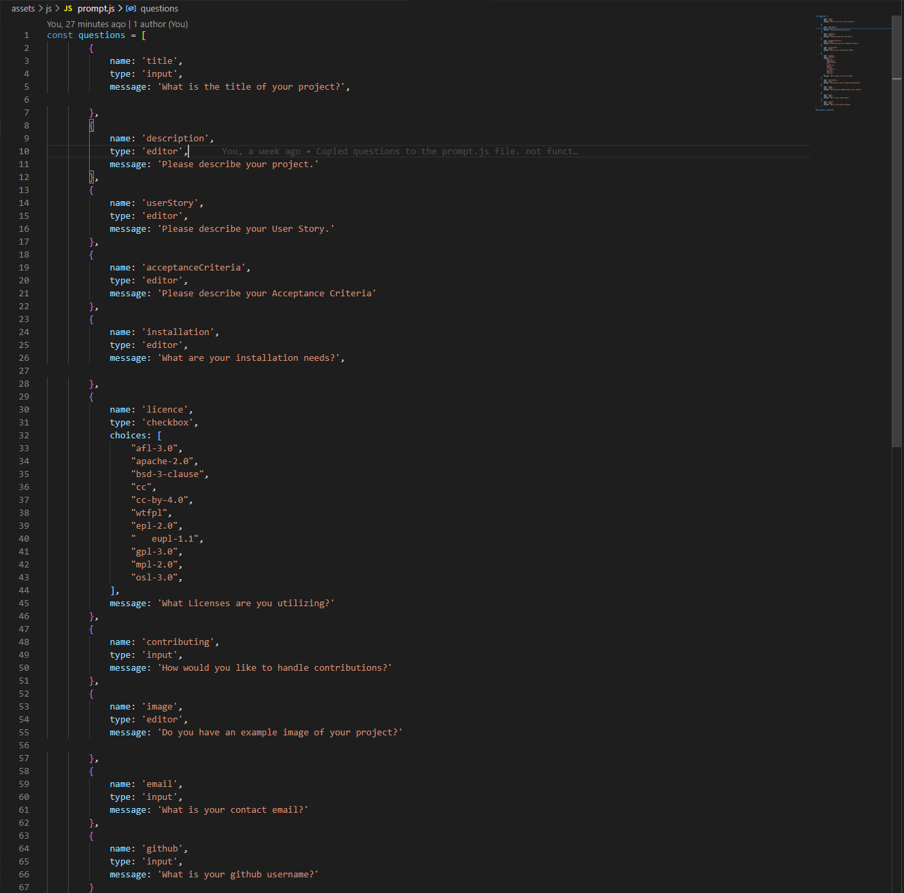

<h1 align="center">README Generator </h1>

<p align="center">
    
    
    
    
    <a href="https://github.com/themancalledzac">
        
    </a>
    <a href="https://twitter.com/themancalledzac">
        
    </a>
    
</p>
  
<p align="center">
    
    
    
    
    
</p>

## Table of Contents

- [Description](#description)
- [User Story](#user-story)
- [Acceptance Criteria](#acceptance-criteria)
- [Table of Contents](#table-of-contents)
- [Installation](#installation)
- [Usage](#usage)
- [Questions](#questions)

## Description

Using node.js and inquirer.js, users can input from a list of questions to pupulate a README.md file for their personal repositories.
The README.md file is created

## User Story

```
As A developer
I WANT a README generator
SO THAT I can quickly and easily create a README for any new project
```

## Acceptance Criteria

```
GIVEN a command-line application that accepts user input
WHEN I am prompted for information about my application repository
THEN a high-quality, professional README.md is generated with the title of my project and sections entitled Description, Table of Contents, Installation, Usage, License, Contributing, Tests, and Questions
WHEN I enter my project title
THEN this is displayed as the title of the README
WHEN I enter a description, installation instructions, usage information, contribution guidelines, and test instructions
THEN this information is added to the sections of the README entitled Description, Installation, Usage, Contributing, and Tests
WHEN I choose a license for my application from a list of options
THEN a badge for that license is added near the top of the README and a notice is added to the section of the README entitled License that explains which license the application is covered under
WHEN I enter my GitHub username
THEN this is added to the section of the README entitled Questions, with a link to my GitHub profile
WHEN I enter my email address
THEN this is added to the section of the README entitled Questions, with instructions on how to reach me with additional questions
WHEN I click on the links in the Table of Contents
THEN I am taken to the corresponding section of the README
```

## Installation

```
npm init -y

npm install inquirer
```

## Usage

Run the following command, while in your root project folder, in the terminal:

```
node index.js
```

## Code

```
index.js file
```


```
template.js file
```


```
prompt.js file
```


